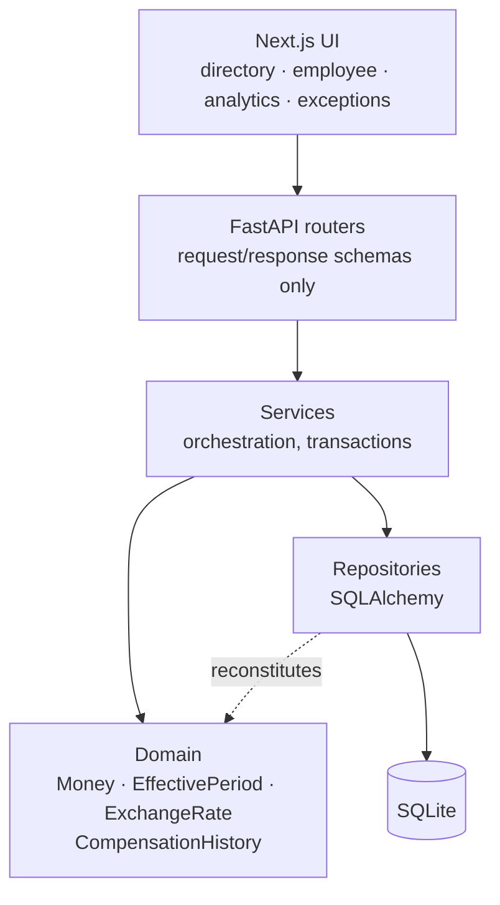
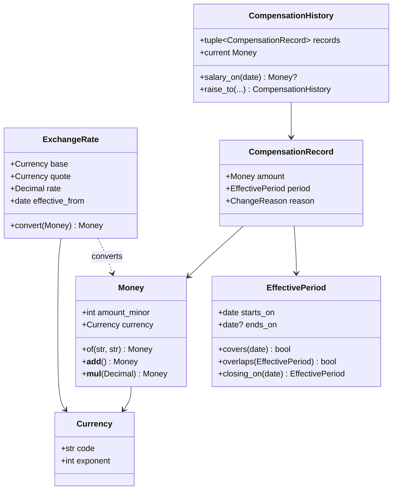

# Design Notes

## Shape of the system

The domain layer imports nothing from FastAPI or SQLAlchemy. That is not
architectural decoration — it is why the 62 domain tests run in milliseconds
with no fixtures, which is what makes test-driving the design practical.

## The domain model

## The three decisions everything else follows from

**Salary is a chain, not a value.** `CompensationHistory` holds records in
chronological order with exactly one open. A raise closes its predecessor the
day before it starts. Nothing is ever edited in place. This is what makes
"what did we pay her in March" and "what did the April cycle cost" answerable
at all, and it is the reason a mutable `salary` column was never on the table.

**Money is an integer and knows its currency.** No floats anywhere, and adding
INR to USD raises rather than producing a plausible wrong number. The
minor-unit exponent lives on `Currency`, so JPY works without a special case.

**Rates are effective-dated.** A historic report converts at the rate that
applied then, so re-running last year's payroll cost gives the same figure it
gave last year.

## Persistence intent

The aggregate's invariant — one open record per employee, no overlaps — is
enforced twice on purpose:

- in the domain, where `raise_to` is the only way to add a record; and
- in the database, by a partial unique index on
  `(employee_id) WHERE effective_to IS NULL`.

The domain check gives a good error message. The index means a bug elsewhere,
a bad migration, or a hand-run `INSERT` cannot corrupt a pay history. Neither
is redundant with the other.

## Scale

10,000 employees at two to five records each is roughly 30,000 rows — small
enough that SQLite holds it in page cache and any query is fast. Server-side
pagination and the indexes exist because the *shape* should be right at
500,000, not because this dataset needs them. The point at which this design
changes is when analytics aggregates start scanning the whole compensation
table per request; the answer then is a materialised current-salary view
refreshed on write, not a different database.
